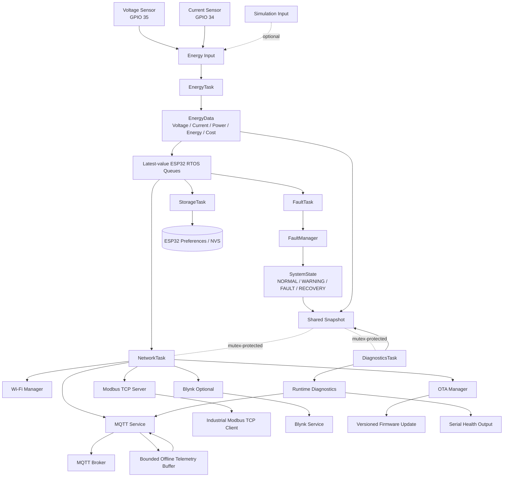

# Industrial Energy Edge Controller

An ESP32-based energy monitoring controller for measuring electrical usage and providing energy data to industrial and IoT systems.

## Project Aim

The aim of this project is to build a reliable ESP32 energy-monitoring edge controller instead of a simple sensor dashboard. The controller measures electrical values, stores cumulative energy, detects abnormal conditions, and shares data with industrial and IoT systems.

Measurement continues independently from Wi-Fi, MQTT, Modbus TCP, Blynk, and OTA services. This keeps the core energy-monitoring function available even when a network service is unavailable.

## Features

- Voltage, current, power, energy, and cost measurement
- Persistent energy storage using ESP32 NVS
- ESP32 RTOS task-based architecture
- Fault detection and recovery states
- Wi-Fi and MQTT connectivity
- Offline MQTT telemetry buffering
- Read-only Modbus TCP telemetry
- Runtime diagnostics
- Simulation input mode
- OTA firmware management

## Architecture



## Hardware

| Signal | ESP32 Pin |
|---|---:|
| Voltage input | GPIO 35 |
| Current input | GPIO 34 |

Sensor calibration and system settings are defined in [include/config.h](include/config.h).

## Interfaces

### MQTT

```text
industrial-energy/<device-id>/telemetry
industrial-energy/<device-id>/status
industrial-energy/<device-id>/fault
industrial-energy/<device-id>/diagnostics
industrial-energy/<device-id>/ota
```

Telemetry is buffered locally when MQTT is unavailable and replayed after reconnect.

### Modbus TCP

The controller provides read-only Modbus TCP telemetry on port `502`.

See [docs/modbus-register-map.md](docs/modbus-register-map.md).

## Configuration

Create the local credentials file:

```bash
copy include/secrets.example.h include/secrets.h
```

Set Wi-Fi, Blynk, and MQTT credentials in `include/secrets.h`. This file is ignored by Git.

## Build and Upload

```bash
pio run -e esp32dev
pio run -e esp32dev -t upload
```

Run native tests with:

```bash
pio test -e native
```

## Project Structure

```text
include/     Headers and configuration
src/         Firmware source code
test/        Native tests
docs/        Architecture and interface documentation
```

Detailed documentation:

- [Architecture](docs/architecture.md)
- [Fault state machine](docs/fault-state-machine.md)
- [MQTT telemetry](docs/mqtt-telemetry.md)
- [Modbus register map](docs/modbus-register-map.md)
- [OTA updates](docs/ota-update.md)


## Results


