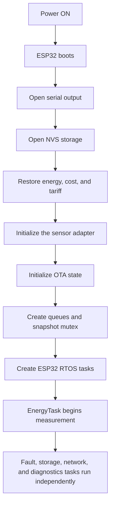
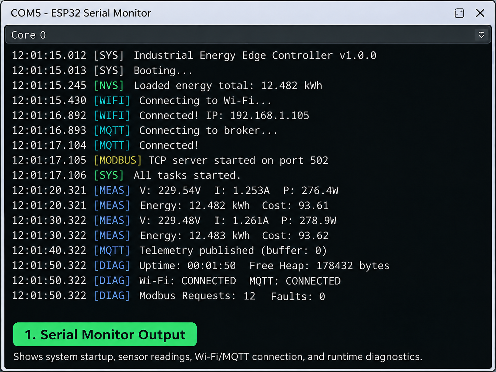
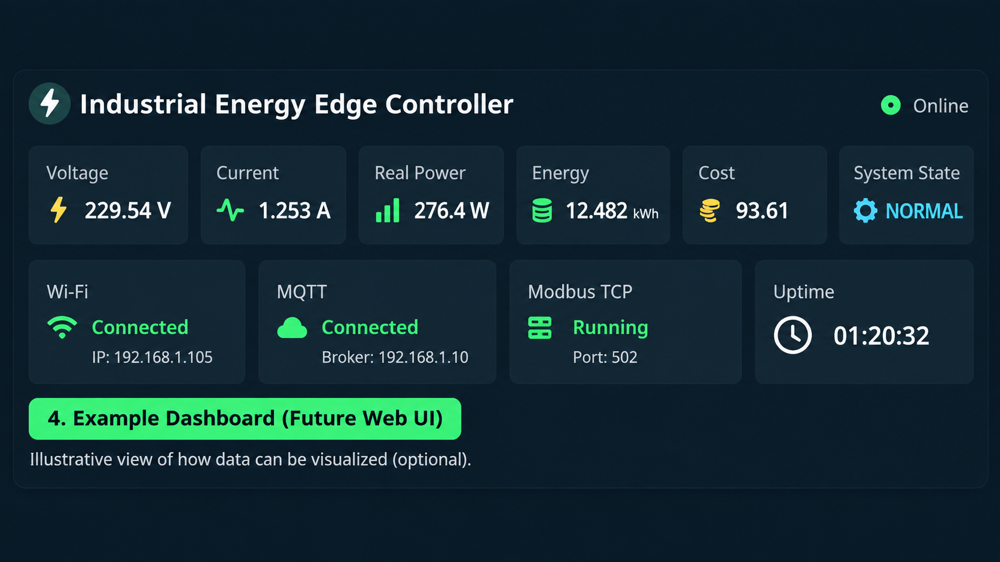
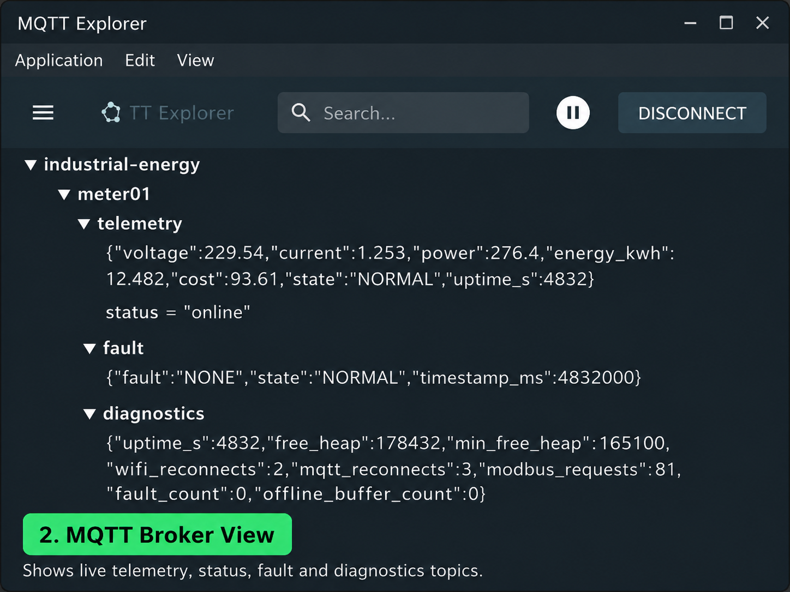
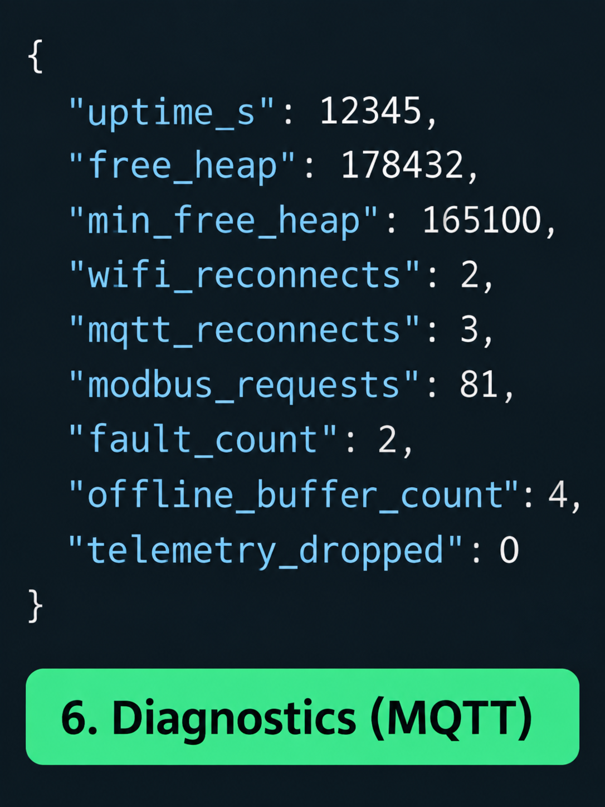
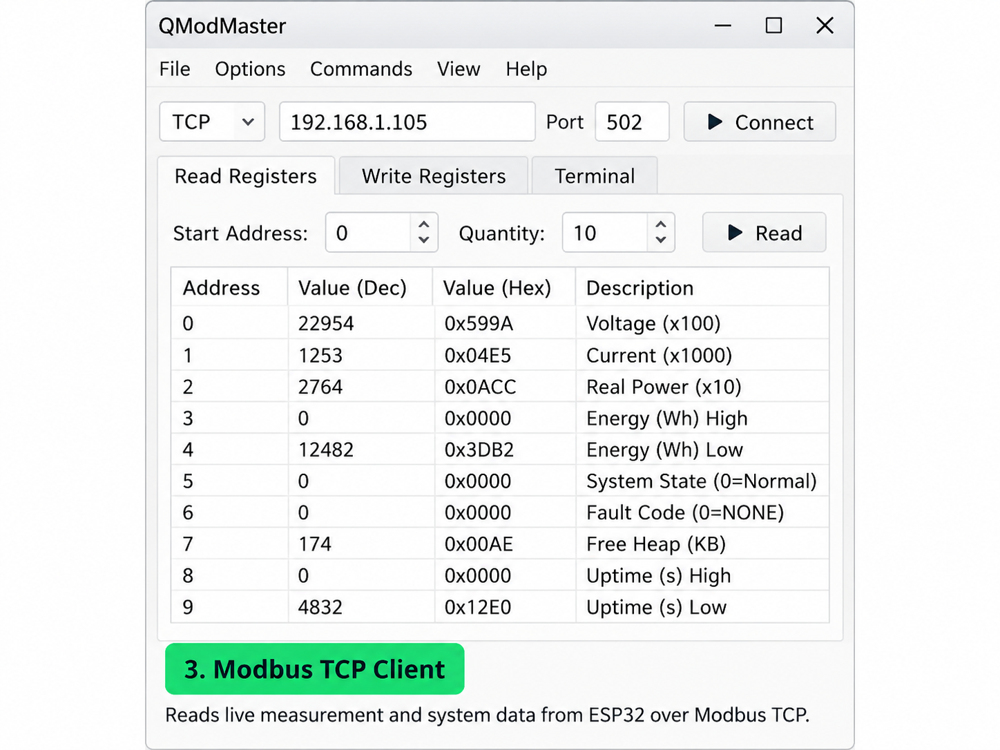
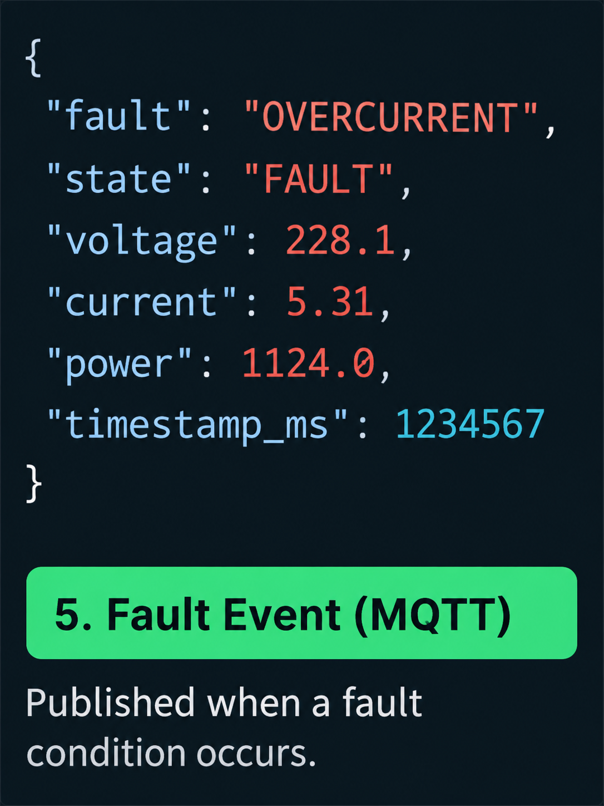

# Industrial Energy Edge Controller

## What is this project?

This project turns an ESP32 into an energy-monitoring edge controller. Voltage and current sensors provide the electrical measurements. The ESP32 calculates power, cumulative energy, and cost. Measurement continues even when the network is unavailable. Separate ESP32 RTOS tasks handle measurement, faults, storage, communication, and diagnostics. Other systems can read the data through MQTT or Modbus TCP. Cumulative energy and cost are restored after a restart from ESP32 NVS storage. The project also contains an isolated OTA firmware-update subsystem.

## What does the complete system do?

```text
Electrical Load
      |
      v
Voltage and Current Sensors
      |
      v
ESP32 Edge Controller
      |-- Calculate power and energy
      |-- Detect abnormal readings
      |-- Save cumulative energy
      |-- Publish telemetry
      |-- Serve Modbus TCP data
      |-- Monitor device health
      |-- Manage firmware updates
      |
      v
Laptop / PLC / MQTT Broker / Dashboard
```

The sensors measure the electrical load. The ESP32 processes the measurements locally. Network clients receive copies of the data, but they are not required for the measurement loop to continue.

## Why this project exists

A simple student project often follows this path:

```text
Sensor -> ESP32 -> Dashboard
```

That is a useful starting point. This project develops the same idea into a more structured controller:

```text
Sensor
  |
  v
ESP32 measurement
  |
  v
Independent processing
  |
  +--> Persistent storage
  +--> Fault management
  +--> MQTT telemetry
  +--> Modbus TCP
  +--> Runtime diagnostics
```

The goal is to show how an embedded device can keep its important local work separate from optional communication services.

## What happens when the controller starts?



Network services start inside `NetworkTask`. A Wi-Fi or broker failure does not prevent `EnergyTask` from running.

## Main features

| Feature | Purpose |
|---|---|
| Energy measurement | Reads voltage and current and calculates power and energy |
| NVS persistence | Restores cumulative energy and cost after restart |
| ESP32 RTOS tasks | Separates work into independent responsibilities |
| Fault management | Detects invalid readings, overcurrent, and abnormal voltage |
| MQTT | Publishes telemetry, faults, diagnostics, and OTA status |
| Offline buffer | Holds recent telemetry during MQTT outages |
| Modbus TCP | Provides read-only industrial register access |
| Diagnostics | Reports uptime, heap, faults, reconnects, and task health |
| Simulation | Provides test input without applying mains conditions |
| OTA manager | Handles version checks, image integrity, and installation flow |

## Hardware

| Signal | ESP32 pin | Calibration |
|---|---:|---:|
| Voltage input | GPIO 35 | `162.7` |
| Current input | GPIO 34 | `1.80` |

System settings are in [include/config.h](include/config.h). Local credentials use `include/secrets.h`, created from `include/secrets.example.h`.

## Interfaces

MQTT topics use the configured device ID:

```text
industrial-energy/<device-id>/telemetry
industrial-energy/<device-id>/status
industrial-energy/<device-id>/fault
industrial-energy/<device-id>/diagnostics
industrial-energy/<device-id>/ota
```

The read-only Modbus TCP server listens on port `502`. See [docs/modbus-register-map.md](docs/modbus-register-map.md).

## Documentation path

Read the documents in this order:

1. [Architecture](docs/architecture.md)
2. [Fault state machine](docs/fault-state-machine.md)
3. [MQTT telemetry](docs/mqtt-telemetry.md)
4. [Modbus register map](docs/modbus-register-map.md)
5. [OTA updates](docs/ota-update.md)

## Project structure

```text
include/     Interfaces, data types, and configuration
src/         Firmware implementation
test/        Portable tests
docs/        Architecture and interface documentation
```

Important modules include `energy_logic`, `energy_meter`, `energy_store`, `fault_manager`, `network_manager`, `mqtt_service`, `telemetry_buffer`, `modbus_server`, `diagnostics`, `ota_manager`, and `version`.

## Setup and build

```bash
copy include/secrets.example.h include/secrets.h
pio run -e esp32dev
pio run -e esp32dev -t upload
pio test -e native
```

Set Wi-Fi, Blynk, and MQTT values in `include/secrets.h`. Do not place real credentials in tracked files.
## Project Structure

```text
include/     Headers and configuration
src/         Firmware source code
test/        Native tests
docs/        Architecture and interface documentation
```

Detailed documentation:

- [Architecture](docs/architecture.md)
- [Fault state machine](docs/fault-state-machine.md)
- [MQTT telemetry](docs/mqtt-telemetry.md)
- [Modbus register map](docs/modbus-register-map.md)
- [OTA updates](docs/ota-update.md)


## Results














