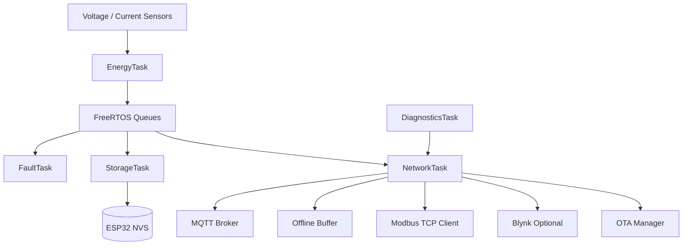

# Industrial Energy Edge Controller

An ESP32-based energy monitoring controller for measuring electrical usage, storing cumulative energy data, detecting faults, and publishing data through industrial and IoT interfaces.

## Features

- Voltage, current, real power, energy, and cost measurement
- Persistent energy and cost storage using ESP32 NVS
- FreeRTOS task-based firmware architecture
- Deterministic fault and recovery state machine
- Non-blocking Wi-Fi reconnection
- Read-only Modbus TCP telemetry
- MQTT telemetry with online/offline status
- Bounded offline telemetry buffering and controlled replay
- Optional Blynk telemetry
- Runtime diagnostics for heap, uptime, faults, reconnects, and task health
- Simulation input mode for software testing
- OTA firmware management with version and SHA-256 integrity checks

## Architecture



### FreeRTOS Tasks

| Task | Responsibility |
|---|---|
| `EnergyTask` | Reads sensors, filters readings, and integrates energy |
| `FaultTask` | Evaluates readings and updates the fault state |
| `StorageTask` | Periodically saves cumulative values to NVS |
| `NetworkTask` | Handles Wi-Fi, MQTT, Modbus TCP, Blynk, and OTA services |
| `DiagnosticsTask` | Collects and prints runtime health information |

Each consumer receives its own one-element latest-value queue. This prevents a slow network or storage service from stopping measurement.

## Hardware Configuration

| Signal | ESP32 Pin | Calibration |
|---|---:|---:|
| Voltage | GPIO 35 | `162.7` |
| Current | GPIO 34 | `1.80` |

Configuration values are centralized in [include/config.h](include/config.h), including sampling periods, fault thresholds, MQTT settings, Modbus port, OTA settings, and buffer capacity.

## Energy Accounting

Energy is calculated from real power and elapsed time:

```text
energy_kWh += power_W * elapsed_hours / 1000
cost        = energy_kWh * tariff
```

Cumulative energy and cost are checkpointed to NVS. A no-load interval does not reset the stored totals.

## Fault Management

The controller uses the following state flow:

```text
NORMAL -> WARNING -> FAULT -> RECOVERY -> NORMAL
```

Current fault conditions include invalid sensor readings, overcurrent, and abnormal voltage. Fault debounce and recovery periods prevent unstable readings from causing immediate state changes.

See [docs/fault-state-machine.md](docs/fault-state-machine.md).

## MQTT Telemetry

Topics use the device ID from `config.h`:

```text
industrial-energy/<device-id>/telemetry
industrial-energy/<device-id>/status
industrial-energy/<device-id>/fault
industrial-energy/<device-id>/diagnostics
industrial-energy/<device-id>/ota
```

The MQTT service publishes retained `online` status and uses an `offline` Last Will message. When the broker is unavailable, telemetry is stored in a fixed-capacity circular buffer. The oldest record is dropped when the buffer is full, and records are replayed gradually after reconnect.

See [docs/mqtt-telemetry.md](docs/mqtt-telemetry.md).

## Modbus TCP

The built-in read-only Modbus TCP server listens on port `502` and supports function codes `0x03` and `0x04`.

Values use explicit integer scaling. For example:

```text
229.54 V -> 22954
1.253 A  -> 1253
276.4 W  -> 2764
```

See [docs/modbus-register-map.md](docs/modbus-register-map.md).

## OTA Firmware Management

`OtaManager` handles:

1. Firmware manifest parsing
2. Semantic version comparison
3. Firmware download
4. Image-size validation
5. SHA-256 integrity validation
6. Firmware installation and reboot
7. Post-update health and rollback confirmation hooks

SHA-256 provides integrity checking. Signed firmware, secure boot, and cryptographic authentication are not implemented.

See [docs/ota-update.md](docs/ota-update.md).

## Simulation Mode

`EnergySimulator` can provide `EnergyData` through the same interface as the real sensor path. Available scenarios include:

- Normal load
- No load
- Overcurrent
- Low voltage
- Invalid reading

## Project Structure

```text
include/     Public interfaces and configuration
src/         Firmware implementation
test/        Portable host-side tests
docs/        Architecture and interface documentation
platformio.ini
```

Important modules:

- `energy_logic`: portable filtering, integration, and cost calculation
- `energy_meter`: EmonLib sensor adapter
- `energy_store`: ESP32 Preferences/NVS storage
- `fault_manager`: fault detection and state transitions
- `network_manager`: Wi-Fi and optional Blynk handling
- `mqtt_service`: MQTT connection, payloads, status, and replay
- `telemetry_buffer`: bounded offline ring buffer
- `modbus_codec` and `modbus_server`: Modbus framing and TCP service
- `diagnostics`: runtime health collection
- `ota_manager`: firmware update control
- `version`: firmware version parsing and comparison

## Setup

1. Install PlatformIO.
2. Copy `include/secrets.example.h` to `include/secrets.h`.
3. Set Wi-Fi, Blynk, and MQTT credentials in `include/secrets.h`.
4. Build and upload the firmware:

```bash
pio run -e esp32dev
pio run -e esp32dev -t upload
```

Run the native tests with:

```bash
pio test -e native
```

`include/secrets.h` is ignored by Git. Do not place real credentials in tracked source files.
