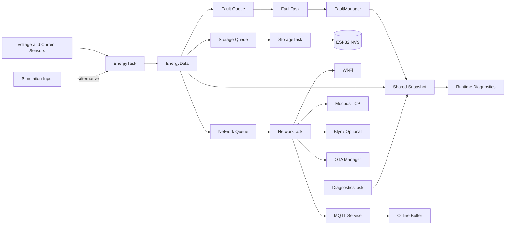

# Architecture

## Start with the problem

The controller receives measurements regularly, but storage and network services may be slower or unavailable. The design therefore separates local measurement from the services that consume the data.

The most important rule is:

```text
Network failure must not stop energy measurement.
```

## What is an ESP32 RTOS task?

An RTOS task is an independent function scheduled by the ESP32. Each task has its own priority, stack, and loop. This project uses tasks so measurement, storage, fault handling, networking, and diagnostics do not need to run inside one large loop.

## Complete data flow



## The task responsibilities

| Task | Responsibility | Priority | Stack setting |
|---|---|---:|---:|
| `EnergyTask` | Reads sensors or simulation input, filters readings, integrates energy, and sends `EnergyData` | 3 | 4096 words |
| `FaultTask` | Consumes the newest sample and updates `FaultManager` | 2 | 3072 words |
| `StorageTask` | Periodically saves cumulative values to NVS | 1 | 3072 words |
| `NetworkTask` | Runs Wi-Fi, MQTT, Modbus TCP, Blynk, and OTA services | 2 | 6144 words |
| `DiagnosticsTask` | Reads health information and prints diagnostics | 1 | 4096 words |

The tasks are not pinned to a CPU core. The current workload does not require core affinity.

## How data moves between tasks

`EnergyData` is the measurement object shared between processing stages. It contains voltage, current, power, cumulative energy, cost, and a validity flag.

The producer sends the newest sample to three separate one-element queues. A queue is a safe handoff between tasks. A one-element queue is appropriate here because consumers need the latest measurement, not every historical sample.

Separate queues are important because receiving from a normal queue removes the item. If all consumers used one queue, the first consumer could take the sample before the others saw it. `xQueueOverwrite()` replaces an older waiting sample with the newest one.

## Shared snapshot and mutex

The shared snapshot contains the latest measurement, fault event, and runtime diagnostics. A mutex protects the short copy operation when tasks read or update that snapshot. Network publishing occurs after the mutex is released so a network call does not hold the lock.

## Startup sequence

1. `setup()` starts serial output.
2. `EnergyStore` opens NVS and restores energy, cost, and tariff.
3. `EnergyMeter` initializes the sensor adapter.
4. `OtaManager` inspects the current OTA image state.
5. Three queues and one snapshot mutex are created.
6. The five ESP32 RTOS tasks are created.
7. `EnergyTask` starts its periodic measurement cycle.
8. `NetworkTask` starts Wi-Fi, MQTT, Modbus TCP, Blynk, and OTA processing independently.

If a required queue, mutex, or task cannot be created, the firmware logs a fatal initialization message.

## Storage boundary

`EnergyStore` is the only module that owns `Preferences` access. `StorageTask` writes at the configured checkpoint interval instead of writing on every sample. This preserves totals while reducing unnecessary flash writes.

## Network boundary

`NetworkTask` owns communication. Wi-Fi reconnects use timestamps rather than a long retry loop. MQTT has its own reconnect state and offline buffer. Modbus TCP is read-only. Blynk publishing is optional. OTA is isolated in `OtaManager`.

## Diagnostics boundary

`DiagnosticsTask` reports uptime, heap, reconnect counts, fault counts, Modbus counts, MQTT buffer counters, OTA counters, and selected task stack watermarks. These values are printed locally and are also available to the MQTT diagnostics payload.
