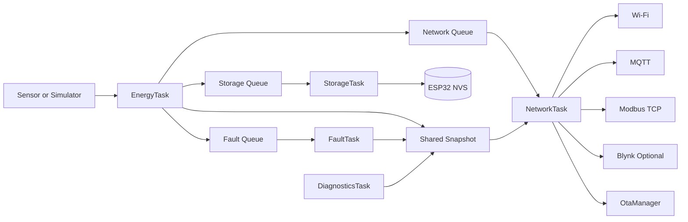

# Firmware Architecture

## Data Flow



## Why the boundaries exist

`EnergyTask` owns sensor acquisition and energy integration. It never waits for Wi-Fi, MQTT, Modbus, Blynk, or OTA.

`FaultTask` consumes the newest sample and owns the fault state machine. `StorageTask` owns NVS writes and checkpoints at a controlled interval instead of writing every sample.

`NetworkTask` owns all network-facing services. It runs timestamped Wi-Fi and MQTT reconnect logic, the Modbus server, optional Blynk publishing, MQTT replay, and OTA coordination.

`DiagnosticsTask` reads the shared snapshot, adds runtime metrics, prints health information, and exposes the values used by MQTT diagnostics.

## Queues and snapshot

There are three one-element queues:

| Queue | Producer | Consumer | Reason |
|---|---|---|---|
| Fault queue | `EnergyTask` | `FaultTask` | Fault logic receives the newest sample |
| Storage queue | `EnergyTask` | `StorageTask` | Storage keeps the newest checkpoint candidate |
| Network queue | `EnergyTask` | `NetworkTask` | Network publishes the newest telemetry |

`xQueueOverwrite()` is used because each queue has capacity one. This intentionally drops an older pending sample when a consumer is behind; cumulative energy is already maintained by EnergyTask, while consumers need the latest state.

The shared snapshot contains the latest `EnergyData`, the current `FaultEvent`, and `RuntimeDiagnostics`. A mutex protects copies of this small structure. Network calls are made after releasing the mutex.

## Priorities and scheduling

| Task | Priority | Stack setting |
|---|---:|---:|
| `EnergyTask` | 3 | 4096 words |
| `FaultTask` | 2 | 3072 words |
| `NetworkTask` | 2 | 6144 words |
| `StorageTask` | 1 | 3072 words |
| `DiagnosticsTask` | 1 | 4096 words |

Tasks are not pinned to a core. There is no current requirement for core affinity, so normal FreeRTOS scheduling keeps the design easier to inspect.

## Failure isolation

The intended dependency direction is:

```text
sensor failure -> fault state and diagnostics
network failure -> reconnect counters and MQTT buffering
MQTT failure   -> telemetry buffer
storage failure -> storage status to be diagnosed
```

None of those network or storage paths is allowed to become a prerequisite for the next energy measurement.

## OTA boundary

`OtaManager` is called by NetworkTask. It owns manifest parsing, semantic version checks, HTTP download, SHA-256 integrity validation, installation, and the post-update health/rollback hook. The HTTP update operation can block NetworkTask during a transfer; it does not run in EnergyTask.
