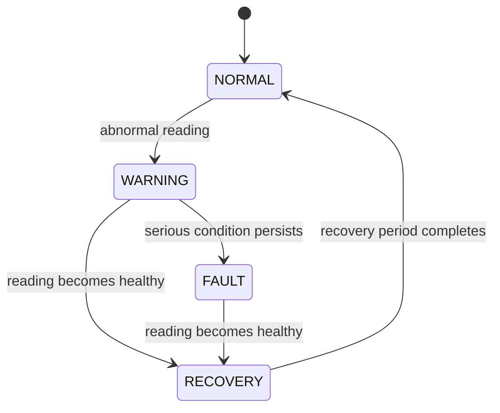

# Fault Management

## Why fault management exists

Sensor readings are not always healthy. A value can be missing, too high, or outside the expected voltage range. The controller needs a predictable response instead of silently publishing every value as if it were correct.

The fault manager converts each `EnergyData` sample into a state and an optional fault code. It does not add measurements that the hardware does not provide.

## States



| State | Meaning |
|---|---|
| `NORMAL` | Readings are healthy |
| `WARNING` | An abnormal reading has appeared, but the serious-condition timer has not completed |
| `FAULT` | A serious condition stayed active through the debounce period |
| `RECOVERY` | Readings are healthy again, but stability is still being confirmed |

There is no direct `FAULT -> NORMAL` transition. This avoids clearing a fault because of one good sample.

## Current fault conditions

| Fault code | Current trigger |
|---|---|
| `INVALID_SENSOR_READING` | The measurement is not valid after filtering |
| `OVERCURRENT` | Current reaches the configured warning or fault threshold |
| `ABNORMAL_VOLTAGE` | Voltage is outside the configured demonstration range |

The enum also contains reserved values for sensor timeout, network disconnection, and low memory. The current measurement path does not actively generate those values.

## Timing and configuration

The thresholds are centralized in [include/config.h](../include/config.h):

| Setting | Value | Meaning |
|---|---:|---|
| `overcurrentWarningA` | 8.0 A | Starts an overcurrent warning |
| `overcurrentFaultA` | 12.0 A | Serious overcurrent threshold |
| `voltageWarningLow` | 200.0 V | Low-voltage boundary |
| `voltageWarningHigh` | 250.0 V | High-voltage boundary |
| `faultDebounceMs` | 2000 ms | Time before a serious condition becomes `FAULT` |
| `faultRecoveryTimeMs` | 10000 ms | Healthy time before returning to `NORMAL` |

These are demonstration values. They are not electrical protection settings or certification values.

## Task flow

```text
EnergyTask
    |
    v
Fault queue
    |
    v
FaultTask
    |
    v
FaultManager -> Shared Snapshot -> Diagnostics / NetworkTask
```

When the state or fault code changes, NetworkTask can publish one MQTT fault event. The same event is not sent continuously on every measurement cycle.
