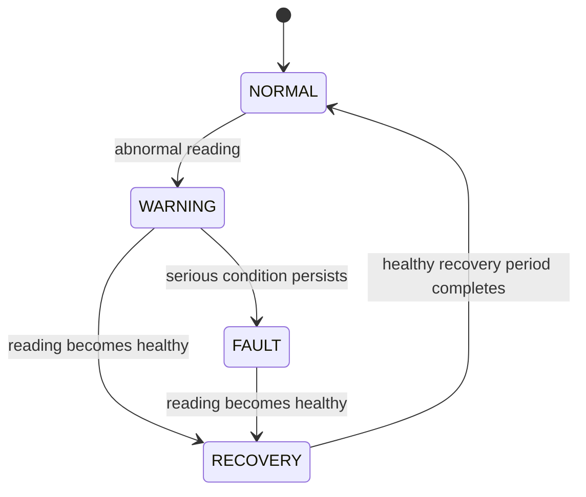

# Fault State Machine

The fault manager turns each `EnergyData` sample into a state and an optional `FaultCode`. It does not infer measurements that the hardware does not provide.

## States

| State | Meaning |
|---|---|
| `NORMAL` | Current reading is healthy |
| `WARNING` | An abnormal reading has appeared but fault debounce is not complete |
| `FAULT` | A serious condition persisted through the debounce period |
| `RECOVERY` | Readings are healthy again, but stability is still being confirmed |

There is deliberately no direct `FAULT -> NORMAL` transition. The recovery period prevents a single good sample from clearing a persistent fault.

## Fault codes currently used

| Code | Trigger in the current code |
|---|---|
| `INVALID_SENSOR_READING` | Sample is not valid after measurement filtering |
| `OVERCURRENT` | Current reaches the configured warning or fault threshold |
| `ABNORMAL_VOLTAGE` | Voltage is outside the configured demonstration range |

The enum also reserves codes for sensor timeout, network disconnection, and low memory, but the current measurement path does not actively generate those conditions.

## Timing and thresholds

Values are in [include/config.h](../include/config.h):

| Setting | Current value | Purpose |
|---|---:|---|
| `overcurrentWarningA` | 8.0 A | Starts an overcurrent warning |
| `overcurrentFaultA` | 12.0 A | Serious overcurrent threshold |
| `voltageWarningLow` | 200.0 V | Low-voltage boundary |
| `voltageWarningHigh` | 250.0 V | High-voltage boundary |
| `faultDebounceMs` | 2000 ms | Time before a serious condition becomes `FAULT` |
| `faultRecoveryTimeMs` | 10000 ms | Healthy time before returning to `NORMAL` |

These are demonstration thresholds. They are not certification or protection settings and must be validated for the installed sensor and electrical system.

## Events

`FaultEvent` carries the state, fault code, timestamp, voltage, current, and real power. NetworkTask publishes an MQTT fault message only when the state or fault code changes, avoiding one duplicate message per measurement cycle.
