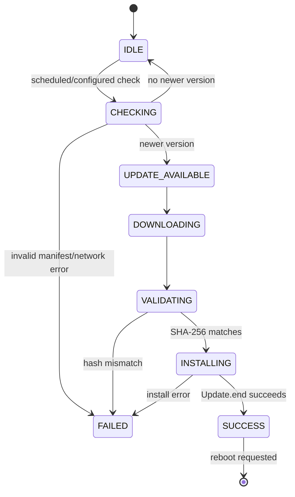

# OTA Update Architecture

OTA is the final service boundary in this project. `OtaManager` is called by NetworkTask; measurement, fault handling, storage, and diagnostics remain separate.

## Versioning

The version is defined once in [include/version.h](../include/version.h):

```text
FIRMWARE_VERSION_MAJOR = 1
FIRMWARE_VERSION_MINOR = 0
FIRMWARE_VERSION_PATCH = 0
```

`parseSemanticVersion()` compares numeric components, so `1.0.10` is newer than `1.0.9`. Version text is included in startup output and diagnostics.

## Manifest

The manifest is a small JSON object:

```json
{
  "version": "1.1.0",
  "firmware_url": "https://updates.example/device.bin",
  "sha256": "0123456789abcdef0123456789abcdef0123456789abcdef0123456789abcdef",
  "size_bytes": 524288
}
```

The parser requires a valid semantic version, an HTTP(S) URL, and exactly 64 hexadecimal SHA-256 characters. Image size is optional but checked when supplied.

The default `config::otaManifestUrl` is empty. This prevents an update check until an operator explicitly configures an update source. There is no arbitrary MQTT URL command.

## State flow



Errors distinguish network unavailable, manifest error, invalid version, download failure, hash mismatch, install failure, and rollback error.

## Integrity versus authenticity

The image is hashed with SHA-256 and compared with the manifest. That proves that the downloaded bytes match the supplied hash. It does not prove who supplied the manifest or hash. This project does not implement signed firmware, signed manifests, secure boot, or a certificate policy.

## Runtime behavior

The Arduino `HTTPClient` and `Update` path performs a blocking download/write operation while an update is active. That work is isolated to NetworkTask; EnergyTask does not wait for it. Network responsiveness is reduced during the transfer, which is an explicit limitation of this implementation.

After installation, the manager requests a reboot. It then checks whether the running image is marked `ESP_OTA_IMG_PENDING_VERIFY`. If the platform is configured for app rollback, the manager confirms the image only after a healthy period with:

- EnergyTask running
- storage initialized
- no critical fault
- free heap above the configured minimum

The ESP32 partition table, bootloader configuration, Arduino-ESP32 version, and build settings determine whether rollback is actually available. Rollback hardware validation is pending.

## Status reporting

OTA transitions are published on:

```text
industrial-energy/<device-id>/ota
```

The payload includes state, error, current version, and target version. MQTT is not required for the health decision or for continued energy measurement.
