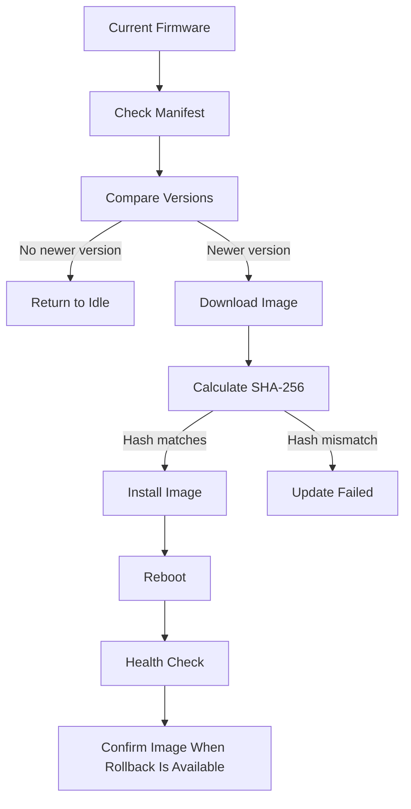

# OTA Firmware Updates

## What is OTA?

OTA means Over-The-Air update. It allows firmware to be downloaded through a network connection instead of requiring a programmer cable.

This project keeps OTA behind `OtaManager` so update logic does not spread through the measurement code. Energy measurement and storage remain separate from the update service.

## Versioning

The firmware version is defined in [include/version.h](../include/version.h):

```text
FIRMWARE_VERSION_MAJOR
FIRMWARE_VERSION_MINOR
FIRMWARE_VERSION_PATCH
```

Versions are compared numerically. For example, `1.0.10` is newer than `1.0.9`.

## Manifest

An update manifest contains the information needed to decide whether an update is valid:

```json
{
  "version": "1.1.0",
  "firmware_url": "https://updates.example/device.bin",
  "sha256": "0123456789abcdef0123456789abcdef0123456789abcdef0123456789abcdef",
  "size_bytes": 524288
}
```

The parser checks the version, URL format, SHA-256 length/characters, and optional image size.

The default manifest URL is empty. An update source must be configured before an update check can occur. There is no arbitrary MQTT URL command.

## Update flow



The manager reports explicit states such as `CHECKING`, `DOWNLOADING`, `VALIDATING`, `INSTALLING`, `SUCCESS`, and `FAILED`. Errors identify problems such as network failure, invalid manifest, download failure, hash mismatch, install failure, or rollback failure.

## Integrity and authentication

SHA-256 confirms that the downloaded bytes match the hash supplied in the manifest. It does not prove who supplied the manifest or the hash. This project does not implement signed firmware, signed manifests, secure boot, or a certificate policy.

## Health and rollback

After reboot, the manager can detect an ESP32 image waiting for verification. When platform rollback support is enabled, it confirms the image only after:

- the measurement task is running
- storage initialized correctly
- no critical fault is active
- free heap is above the configured minimum

Rollback depends on the ESP32 partition table, bootloader settings, and platform configuration. The project provides the software hook, but the rollback behavior must be tested on the target board.

## Runtime limitation

The Arduino HTTP/update operation can block `NetworkTask` while an image is being downloaded and written. It does not run inside `EnergyTask`, so normal measurement code remains separate, but network service responsiveness is reduced during an update.
